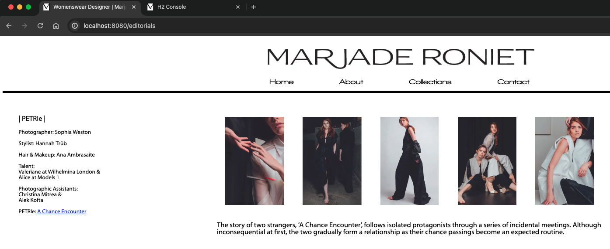
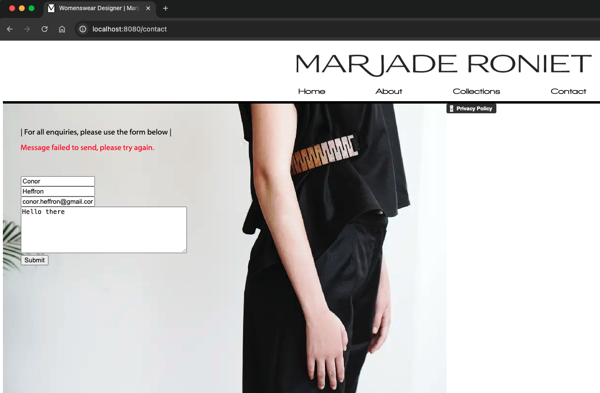
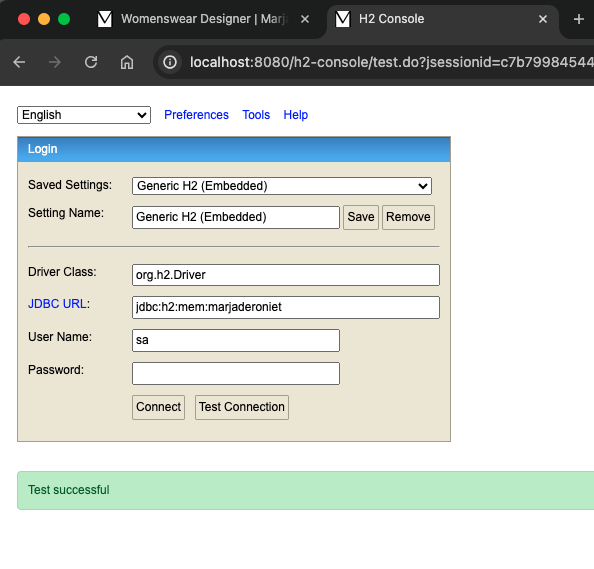
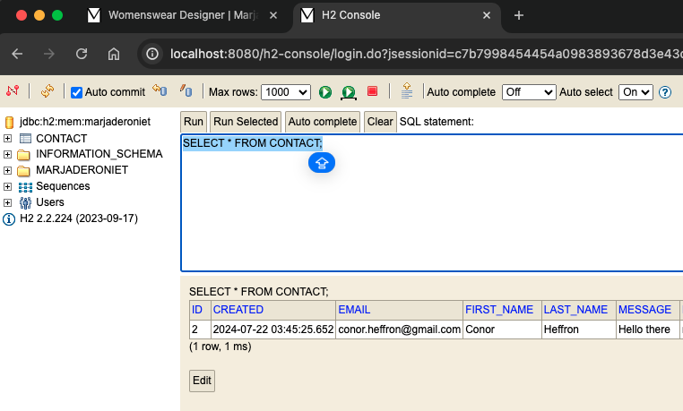

[](https://github.com/conorheffron/marjaderoniet/actions/workflows/maven.yml)


Personal website for women's wear designer http://marjaderoniet.com/

Tech Stack: Java 21, Spring Boot 3, angularJS 1.6.1, HTML5, & JQuery

## Build project, run unit & integration tests, & generate jar file.
```
mvn clean package
```

## Run application
```
mvn spring-boot:run
```

## Build & run via Docker
```
docker image build -t marjaderoniet .
docker compose up -d
```

## View Single Page Application (Angular SPA)
```
http://localhost:8080/
```




## View contact requests in embedded DB
```
http://localhost:8080/contact
```


```
http://localhost:8080/h2-console
```






